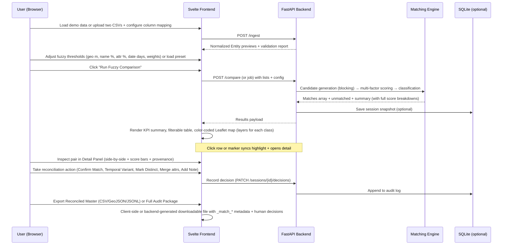

# Fuzzy Entity Reconciler

**A lightweight, self-hostable web service for fuzzy comparison of two entity lists** — identifying temporal variants (same entity, different analyzed dates) and spatial proximity candidates (nearby items with matching characteristics that real-time correlation would have linked but imports did not).

Built for data reconciliation, POI/asset/sensor cleaning, import diffing, and operational sustainment (e.g. Sentinel POI Manager workflows). Local-first, no cloud/LLM required for core fuzzy logic. Fast on modest hardware.

---

## Quick Start

```bash
# Clone and setup
python3 -m venv .venv
source .venv/bin/activate
pip install -e ".[test]"
python scripts/generate_sample_data.py

# Terminal 1 — API (default 8010; change if free)
make backend

# Terminal 2 — UI
cd frontend && npm install && npm run dev
```

Open **http://127.0.0.1:5173** → **Load sample inventories** → **Facility Loose** → **Run comparison** → review candidates → **Proceed to Merge board** → **Publish working set**.

Or one-shot API check:

```bash
curl -s http://127.0.0.1:8010/health
curl -s -X POST http://127.0.0.1:8010/compare/demo -H 'content-type: application/json' -d '{"max_geo_distance_m":350,"date_tolerance_days":30}'
```

Operator flow: commit dispositions (merge / temporal update / keep separate) on candidates, watch category inventory for over-count risk, then publish the working merge set.

---

## Why This Exists

Imported lists fragment real-world entities. Dates drift, names vary, GPS jitters, attributes are represented differently. Humans instantly recognize "these two records are the same cell site 180 m apart". This tool makes that judgment scalable, transparent, and auditable with tunable fuzzy + geo + temporal logic + visual reconciliation.

---

## Architecture

```mermaid
flowchart TD
    subgraph Frontend["Frontend (Svelte 5 + Vite + Tailwind + Leaflet)"]
        UI[Upload / Mapping<br/>Config Sliders + Presets<br/>KPI Cards + Filterable Table<br/>Interactive Map (layers, popups, sync)<br/>Detail Reconciliation Panel<br/>Reconciled Master + Exports]
    end

    subgraph Backend["Backend (FastAPI + Pydantic + Uvicorn)"]
        API[API Layer: /ingest, /compare, /demo, /sessions, /presets]
        Engine[Matching Engine<br/>- Candidate blocking (geo grid + name)<br/>- Scoring: haversine geo + rapidfuzz name + attr overlap + temporal decay<br/>- Classification rules (exact / strong / temporal_variant / spatial_proximity_candidate / weak / unmatched)
    ]
    end

    SQLite[(SQLite — Sessions, Decisions, Presets, Audit Log)]

    UI -->|fetch/preview| API
    UI -->|POST lists + config| API
    API --> Engine
    Engine -->|structured results| API
    API -->|persist decisions| SQLite
    API <--> SQLite
    Engine -.->|pure Python, minimal deps| pandas + rapidfuzz
```

**Key Components**
- **Frontend**: Modern responsive Svelte UI with Leaflet map, TanStack Table or equivalent, reactive state.
- **Backend**: Clean FastAPI with Pydantic models. Matching logic isolated in `matching/engine.py` for easy testing.
- **Persistence**: Optional lightweight SQLite for sessions (shareable comparison IDs) and manual reconciliation audit trail.
- **Deployment**: Docker/Kamal friendly, single-command local run.

---

## Interaction Sequence



---

## OpenSpec (Authoritative Spec)

The complete living specification is in:

**`openspec/specs/fuzzy-reconciler/spec.md`**

It contains:
- Purpose
- Formal SHALL requirements with multiple Gherkin-style scenarios
- Data model, matching pipeline details (candidate gen, scoring formulas, classification rules)
- Full UI flows and API surface
- Non-functional targets + Cursor implementation guidance

A parallel Gherkin feature file for BDD tests lives at `features/fuzzy-reconciler.feature`.

Use your standard OpenSpec + Beads + Cursor workflow to break this down and implement.

---

## Development Handoff Plan: Sample Data, Key Displays & Screenshots

**Goal for Cursor implementation handoff**: Produce a working MVP quickly, with realistic demo data that visibly exercises the temporal_variant and spatial_proximity_candidate logic, plus polished key screens whose screenshots will serve as living documentation and validation artifacts.

### 1. Sample Data Plan (fixtures/)

Create a Python generator script (or hard-coded realistic JSON) that produces two lists with **controlled, intentional overlaps** so the fuzzy logic shines.

**Recommended Schema (core + passthrough attrs)**
```json
{
  "id": "string or int (list-local)",
  "name": "string",
  "lat": float,
  "lon": float,
  "analyzed_at": "ISO-8601 datetime string",
  "category": "string (e.g. facility, poi, sensor, tower)",
  "height_m": number (optional),
  "operator": "string",
  "status": "string",
  "attrs": { "extra": "key-values for similarity scoring" },
  "original_row": { ... } // full original for provenance
}
```

**Data Generation Strategy (script in scripts/generate_sample_data.py)**
- Base pool: ~80 realistic entities (mix of towers, facilities, sensors in a small FL-like geo area).
- **Exact / near-exact matches**: 15–20 items copied with tiny jitter or identical.
- **Temporal variants** (key demo): 5–8 items — same core fields + analyzed_at shifted 3–25 days, small geo drift (5–40 m), name 95–100% similar or slight abbreviation.
- **Spatial proximity candidates** (the "would have been correlated" case): 4–6 items — name changed ("North Tower Array" vs "Site NT-07"), geo offset 80–350 m, category + operator + height/attrs 75–92% overlap.
- **True uniques + noise**: Remaining items unique; add a few with missing name or out-of-range coords to test validation.
- Two variants:
  - `small_demo.json` (~60–80 total per list) — instant load, perfect for UI dev and screenshots.
  - `medium_perf.json` (~1500–2000 per list) — for performance testing the engine.
- Store both lists (A and B) + a "ground truth" mapping file for automated tests.
- Demo endpoint `/demo/sample` serves the small set.

This data makes the classifications obvious on first run: you will see temporal orange badges and amber spatial candidates mixed with green matches.

### 2. Key Displays / Screens to Build (Priority Order for MVP)

1. **Ingestion & Schema Mapping Screen**
   - Dual drag-and-drop zones (or browse) for List A / List B (CSV + JSON support).
   - Live preview table (first 5–8 rows) with detected columns.
   - Mapping UI: dropdowns or drag-to-map for core fields (name, lat, lon, analyzed_at, category) + "treat remaining as attributes" toggle.
   - Prominent **Load Demo Data** button (bypasses upload).
   - Validation summary (row errors highlighted).
   - "Continue to Configuration" button.

2. **Configuration Panel** (sidebar or expandable section)
   - Grouped controls: Geo Distance (slider + number, m), Name Similarity (%), Attr Overlap (%), Date Tolerance (days).
   - Weight sliders or numeric inputs (geo/name/attr/temporal) with live sum-to-1.0 validation.
   - Preset chips: "POI Strict", "Facility Loose", "Sensor Temporal", "Custom".
   - Advanced: JSON editor toggle for full config object.
   - Optional live "estimated matches" indicator (re-run light scoring on sample).
   - Big primary **Run Fuzzy Comparison** button.

3. **Results Dashboard** (main post-run view — split or tabbed)
   - Header: KPI cards row (color-coded: green Exact/Strong, orange Temporal, amber Spatial, gray Unmatched, etc.) with counts and %.
   - Global filters: classification multi-select chips, score range sliders, search input (across names/attrs).
   - Main area: **Responsive split** — Left: Filterable/sortable results table (TanStack Table). Columns include Classification badge, Composite %, Geo Dist (m), Name Sim, Attr Sim, Date Diff, Name A | Name B, Quick Actions (Inspect / Confirm / Reject).
   - Right (or bottom on mobile): **Interactive Leaflet map** — Layer toggles (checkboxes for each classification), markers colored by class, polylines connecting matched pairs, click marker ↔ highlights table row, popup with mini scores + key fields.
   - "Re-run with current config" and "Clear / New Comparison" actions.

4. **Detail Reconciliation Panel** (drawer, modal, or persistent side panel — triggered from table row or map marker)
   - Header: Pair ID + final classification badge + composite score (big number + color).
   - Two-column comparison: Entity A vs Entity B (all fields, with diff highlighting on changed attrs).
   - Score breakdown section: Horizontal or vertical bars (or simple radar) for geo / name / attr / temporal scores + explanations.
   - Provenance footer: Source lists, original IDs/rows, analysis timestamps.
   - Action button row (prominent): 
     - Confirm as Match & Merge into Master
     - Confirm as Temporal Variant (Update)
     - Mark as Distinct (keep separate)
     - Merge Specific Attributes... (sub-UI)
     - Create / Add to Cluster
   - Notes textarea + "Save Decision" (writes to audit log).

5. **Reconciled Master & Export View** (tab or dedicated section)
   - Accumulating list of user-confirmed items with provenance badges.
   - Ability to edit/revert individual decisions.
   - Export dialog: Choose format (CSV with _match_* columns, GeoJSON, JSONL), include full scores/audit?, filename.
   - One-click "Download Reconciled Master + Audit Log (ZIP)" for complete handoff to downstream systems.

### 3. Screenshot / Visual Validation Plan (for docs + PRs)

After each major UI slice is functional, capture clean, realistic screenshots (light theme preferred for docs, plus dark mode variant). Use realistic demo data so temporal and spatial candidates are clearly visible.

**Priority screenshots to produce:**
- Full Ingestion screen with demo data loaded and mapping UI open.
- Configuration panel expanded, showing custom weights and a preset selected.
- Results Dashboard: table + map side-by-side, with mixed classifications visible (call out 1–2 temporal variants and 2 spatial candidates in caption).
- Map zoomed on a spatial cluster with popups open and layer toggles visible.
- Detail Panel open on a `spatial_proximity_candidate` showing score breakdown and action buttons.
- Detail Panel on a `temporal_variant` (date diff highlighted).
- After several manual reconciliations: Reconciled Master tab + pending export dialog.
- Responsive / tablet view of the dashboard (or note mobile breakpoints).

Store screenshots in `docs/screenshots/` (numbered + descriptive filenames) and reference them in README and any future docs/ADR.

These visuals will immediately demonstrate the value of the fuzzy + geo + temporal logic and serve as acceptance criteria for the UI work.

---

## Suggested Project Structure

(See the tree in the original concept. Start with `src/fuzzy_reconciler/matching/engine.py` + tests, then API, then frontend components in priority order above.)

**Tech Stack Alignment** (your existing patterns):
- Backend: FastAPI + Pydantic v2 + pandas/pol ars + rapidfuzz
- Geo: pure Python haversine (no extra deps for MVP)
- Frontend: Svelte 5 + Vite + Tailwind + shadcn-svelte + Leaflet
- Tables: TanStack Table
- Persistence: Optional SQLite (aiosqlite)
- Container: Docker + Kamal
- Testing: pytest + pytest-bdd + Playwright (key flows)

---

## Next Steps & Handoff to Cursor

1. This repo is the canonical home.
2. The `openspec/specs/fuzzy-reconciler/spec.md` is the source of truth — update it as you learn.
3. Break into Beads issues from the Requirements + Scenarios.
4. Implement in thin vertical slices (data model + engine first — very testable).
5. Use the sample data plan and screenshot list above as acceptance criteria and documentation artifacts.
6. When core flows work end-to-end with demo data, capture the screenshots and update README with embedded images.

PRs welcome. Questions or spec tweaks? Open an issue or edit the OpenSpec directly.

---

**Status**: MVP prototype runnable. Beads in `BEADS.md` / `bd list`.

MIT License. Built in the pragmatic, local-first style of related projects.