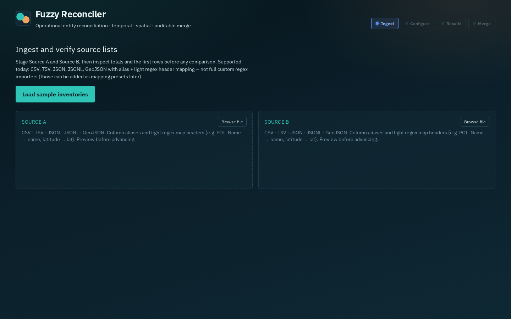
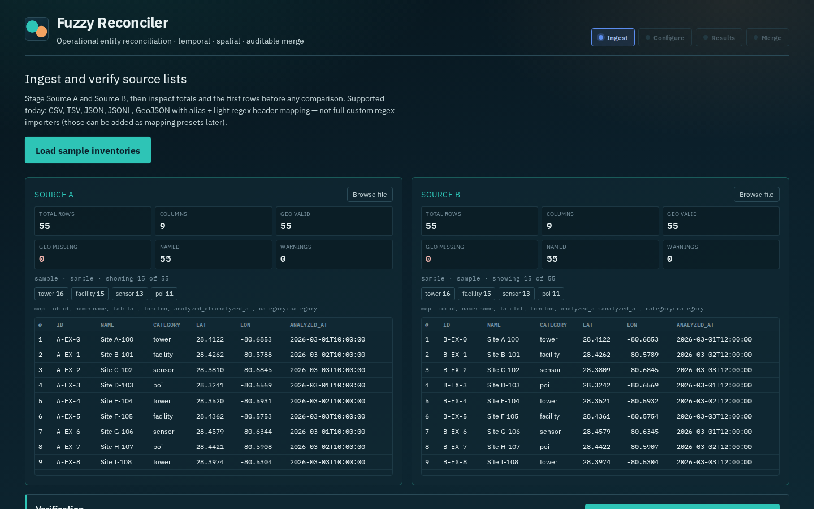
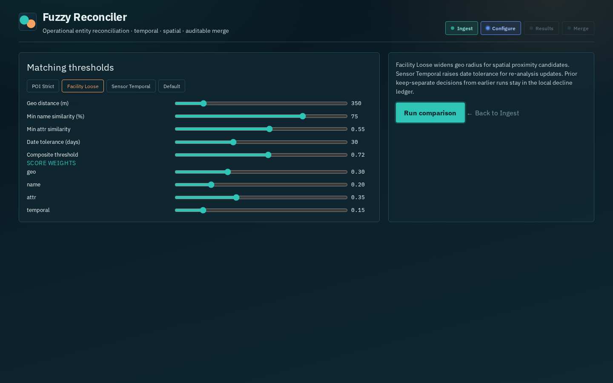
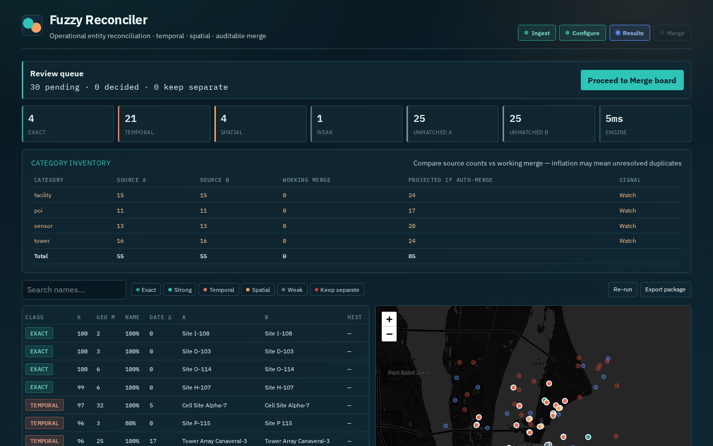
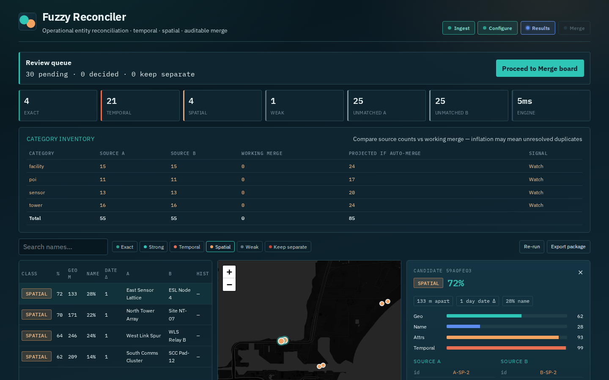
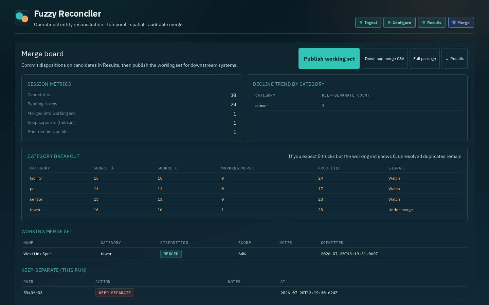
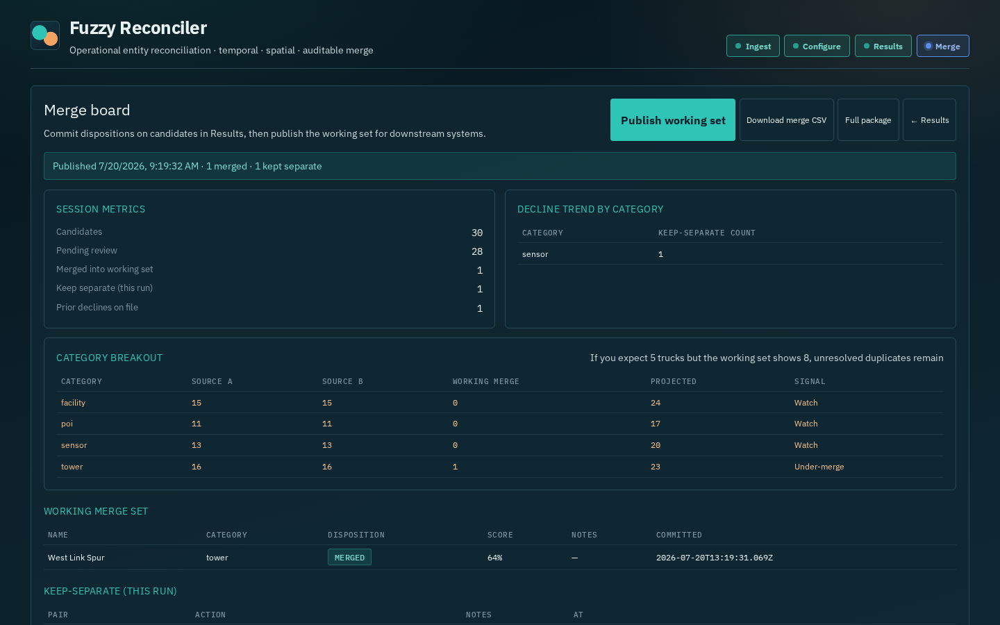
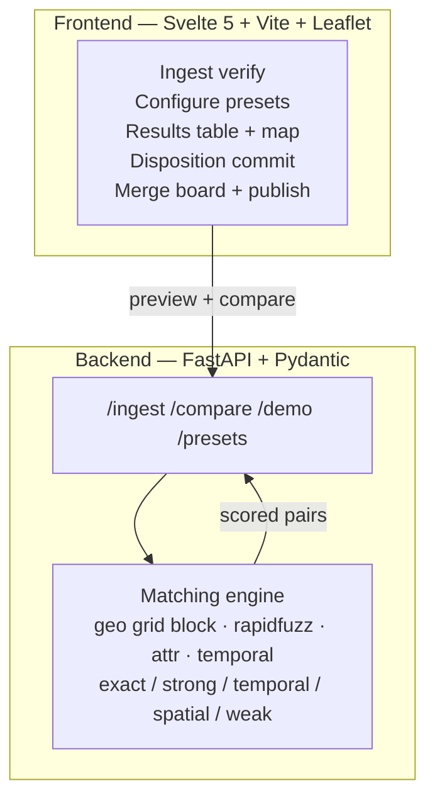
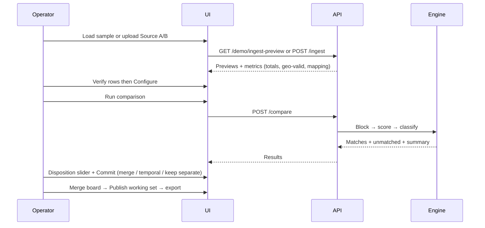

# Fuzzy Entity Reconciler

Operational web service for fuzzy comparison of two entity lists. Surfaces **temporal variants** (same entity, different analysis dates) and **spatial proximity candidates** (nearby records with matching characteristics that were never linked at import), then supports auditable merge / keep-separate decisions.

Local-first. No cloud or LLM required for core matching.

---

## Status

**Runnable MVP on `main`.** Operator workflow:

**Ingest → Configure → Results → Merge**

| Capability | Status |
|------------|--------|
| Multi-format ingest (CSV, TSV, JSON, JSONL, GeoJSON) + alias/regex header mapping | Shipped |
| Ingest verification (totals, geo-valid, first 15 rows) before compare | Shipped |
| Matching engine (geo / name / attr / temporal) with classification rules | Shipped |
| Results KPIs, filterable table, Leaflet map sync | Shipped |
| Candidate disposition slider (merge / temporal update / keep separate) + commit | Shipped |
| Decline ledger (local) for prior keep-separate awareness | Shipped |
| Category inventory / over-count signals | Shipped |
| Merge board + publish working set + CSV/JSON export | Shipped |
| API robustness suite + import fixtures | Shipped (`make test`, 29+ tests) |

Living spec: `openspec/specs/fuzzy-reconciler/spec.md` · Gherkin: `features/fuzzy-reconciler.feature` · Beads: `BEADS.md` · Import/compare report: `docs/TEST-REPORT-IMPORT-COMPARE.md`

---

## Quick start

```bash
python3 -m venv .venv
source .venv/bin/activate
pip install -e ".[test]"
python scripts/generate_sample_data.py

# Terminal 1 — API on :8010
make backend

# Terminal 2 — UI on :5173
cd frontend && npm install && npm run dev
```

Open **http://127.0.0.1:5173**

1. **Load sample inventories** (or browse CSV/TSV/JSON/JSONL/GeoJSON per source)
2. Verify totals and preview rows → **Data looks correct — advance to Configure**
3. Select a preset (e.g. Facility Loose) → **Run comparison**
4. Review candidates; set disposition and **Commit**
5. **Proceed to Merge board** → **Publish working set**

API smoke:

```bash
curl -s http://127.0.0.1:8010/health
curl -s http://127.0.0.1:8010/demo/ingest-preview | head -c 200
make test   # regenerates import samples + runs pytest
```

---

## Operator walkthrough















Refresh captures (API + Vite running):

```bash
cd frontend && node ../scripts/capture-screenshots.mjs
```

---

## Architecture



| Layer | Implementation |
|-------|----------------|
| Frontend | Svelte 5, Vite, Tailwind, Leaflet |
| Backend | FastAPI, Pydantic v2, rapidfuzz, haversine (pure Python) |
| Fixtures | `fixtures/small_demo.json`, `fixtures/imports/*` |
| Tests | `pytest` API + engine + ingest (`make test`) |
| Container | `Dockerfile`, `docker-compose.yml` (API :8010) |

---

## Workflow (current)



**Keep-separate** decisions are stored in a browser-local decline ledger so future runs can flag the same pair as previously declined.

---

## Project layout

```
src/fuzzy_reconciler/
  api/app.py              # FastAPI surface
  ingest.py               # Format sniff + mapping + metrics
  matching/engine.py      # Compare pipeline
  models.py / presets.py
frontend/                 # Operator UI
fixtures/                 # Demo + import samples
tests/                    # Engine, ingest, API robustness
docs/screenshots/         # Current UI captures
docs/TEST-REPORT-IMPORT-COMPARE.md
openspec/specs/…/spec.md
```

---

## License

MIT.
