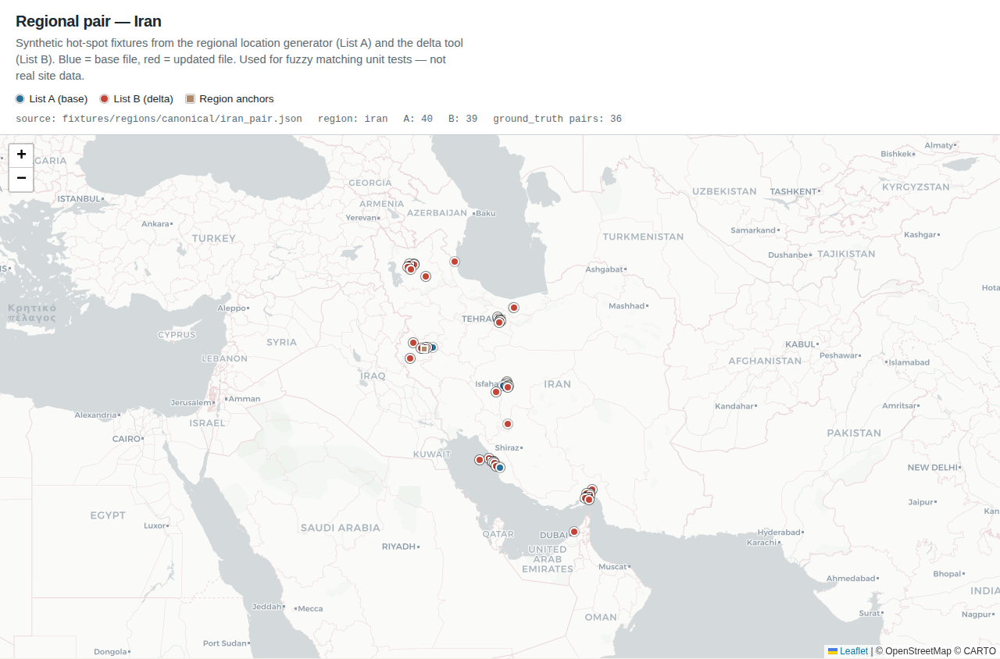

# Regional location generator & delta tool

Synthetic fixtures for stress-testing ingest and fuzzy matching. Entities are
**not** real sites — they are clustered around public geographic anchors so tests
can exercise temporal variants and spatial proximity candidates at scale.

| Script | Role |
|--------|------|
| `scripts/generate_regional_locations.py` | Build a **base** List A for a hot-spot region |
| `scripts/generate_delta.py` | Derive an updated List B with controlled match classes |
| `scripts/plot_regional_pair_map.py` | Map a pair fixture (blue = A, red = B) |

OpenSpec: **Requirement: Synthetic Regional Test Data Generation** in
`openspec/specs/fuzzy-reconciler/spec.md`.

---

## Sample map — Iran canonical pair

Committed fixtures under `fixtures/regions/canonical/` (40 base entities + delta).

**Blue** = List A (`iran_base.json` from the regional generator)  
**Red** = List B (`iran_delta.json` from the delta tool)  
**Tan squares** = region anchors (Tehran, Isfahan, Bushehr, …)



Interactive HTML (same data, pan/zoom):

[`docs/maps/regional-pair-map.html`](maps/regional-pair-map.html)

Offline scatter fallback (no tiles): [`screenshots/08-regional-pair-scatter.png`](screenshots/08-regional-pair-scatter.png)

```bash
python scripts/plot_regional_pair_map.py
# also captures the Leaflet basemap PNG when Playwright is available:
python scripts/plot_regional_pair_map.py --screenshot
```

### What this sample shows

| Side | Count | Source |
|------|------:|--------|
| List A (blue) | 40 | `generate_regional_locations.py --region iran --count 40` |
| List B (red) | 39 | Delta of A (`--fraction 0.9`) + a few unique noise points |
| Anchors | 6 | Tehran, Isfahan, Bushehr, Bandar Abbas, Tabriz, Kermanshah |
| Ground-truth labels | 36 | exact / temporal / spatial / weak expectations for tests |

Many red points sit near a blue counterpart (tiny jitter, date shift, or ~80–250 m
offset). That is intentional: the matching engine should surface
`temporal_variant` and `spatial_proximity_candidate` pairs consistent with
`ground_truth` in the pair fixture.

---

## 1. Regional location generator

```bash
python scripts/generate_regional_locations.py \
  --region iran \
  --count 200 \
  --seed 42 \
  --out fixtures/regions/iran_base.json

# all regions at once (writes fixtures/regions/<region>_base.json)
python scripts/generate_regional_locations.py --region all --count 50 --out fixtures/regions/
```

**Regions:** `gulf`, `iran`, `venezuela`, `cuba`, `russia`, `china` (or `all`).

**Categories** (rotated across entities):

- `surveillance_radar`, `early_warning_radar`, `sam_site`, `ballistic_missile_site`
- `coastal_defense`, `command_post`, `airbase_support`, `elint_site`

**How points are placed**

1. Pick a documented **anchor** (name + lat/lon) for the region.
2. Offset mostly within ~18 km (tight cluster), sometimes out to ~80 km.
3. Clamp to a loose regional bbox so points stay on-land-ish without a landmask library.
4. Assign name, `analyzed_at`, and attributes (`status`, `height_m`, `band`, `operator`, …).

**Output shape**

```json
{
  "meta": {
    "region": "iran",
    "count": 200,
    "seed": 42,
    "anchors": [{ "name": "Tehran area", "lat": 35.69, "lon": 51.39 }],
    "categories": ["surveillance_radar", "..."]
  },
  "entities": [
    {
      "id": "IRA-00001",
      "name": "Surveillance Radar IRA-0001",
      "lat": 35.71,
      "lon": 51.40,
      "analyzed_at": "2026-02-18T…Z",
      "category": "surveillance_radar",
      "attributes": { "region": "iran", "status": "active", "…": "…" }
    }
  ]
}
```

Deterministic given `--seed`. Pure stdlib.

---

## 2. Delta tool

Takes a base file and builds List B with controlled variations for classification tests.

```bash
python scripts/generate_delta.py \
  --base fixtures/regions/iran_base.json \
  --out fixtures/regions/iran_delta.json \
  --also-write-pair fixtures/regions/iran_pair.json \
  --fraction 0.85 \
  --seed 99
```

| Bucket | Typical tweak | Expected class |
|--------|---------------|----------------|
| Exact / near-exact | ≤ ~12 m jitter, same-ish name | `exact_match` / strong |
| Temporal | Date shift within tolerance, mild name/attr drift | `temporal_variant` |
| Spatial | ~80–250 m offset, **strong** name rename, attrs kept | `spatial_proximity_candidate` |
| Weak / unique | Larger drift or brand-new B-only rows | weak / unmatched |

`--also-write-pair` emits `{ list_a, list_b, ground_truth, meta }` for direct
`compare_lists` / API tests.

Fractions (`--exact-frac`, `--temporal-frac`, `--spatial-frac`) control the mix
among retained entities (`--fraction` of base carried into B).

---

## 3. Makefile & checkout

| Target | Purpose |
|--------|---------|
| `make fixtures-regions-canonical` | Regenerate committed Iran 40-entity set |
| `make fixtures-regions-small` | ~50 / region (gitignored) |
| `make fixtures-regions` | ~500 / region (gitignored) |
| `make test` | Includes `tests/test_regional_fixtures.py` |

**Committed:** `fixtures/regions/canonical/*` (small, for CI).  
**Gitignored:** large `fixtures/regions/*_base.json` / `*_delta.json` / `*_pair.json`.

Details: [`fixtures/regions/README.md`](../fixtures/regions/README.md).

---

## 4. How tests use this

1. Ingest base JSON → `geo_valid == entity count`.
2. Compare pair with facility-loose config (`max_geo` ~350 m, `date_tolerance` 30 days).
3. Assert summary counts include temporal + spatial classes.
4. Spot-check `ground_truth` pair labels against engine classifications.
5. Optional smoke: generate ~500 entities, compare in &lt; 15 s.

See `tests/test_regional_fixtures.py` and GitHub issue #11.

---

## Quick regenerate + map

```bash
make fixtures-regions-canonical
python scripts/plot_regional_pair_map.py
# open docs/maps/regional-pair-map.html in a browser
```
