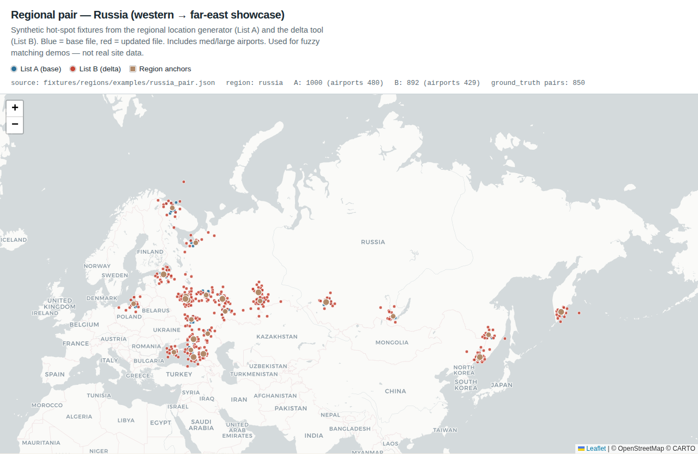
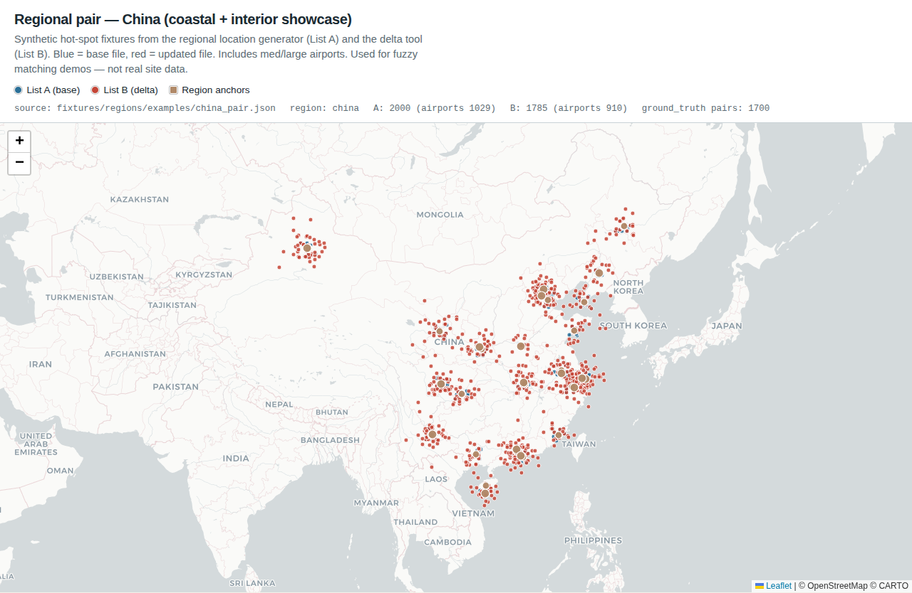

# Regional location generator & delta tool

Synthetic fixtures for stress-testing ingest and fuzzy matching. Entities are
**not** real sites — they are clustered around public geographic anchors so tests
can exercise temporal variants and spatial proximity candidates at scale.

| Script | Role |
|--------|------|
| `scripts/generate_regional_locations.py` | Build a **base** List A for a hot-spot region |
| `scripts/generate_delta.py` | Derive an updated List B with controlled match classes |
| `scripts/generate_showcase_regions.py` | All-region showcase (Russia **1000**, China **2000**) + maps |
| `scripts/plot_regional_pair_map.py` | Map a pair fixture (blue = A, red = B) |

OpenSpec: **Requirement: Synthetic Regional Test Data Generation** in
`openspec/specs/fuzzy-reconciler/spec.md`.

---

## Showcase gallery — all regions

Expected examples under `fixtures/regions/examples/` (includes **medium_airport** /
**large_airport** categories). **Blue** = List A (generator), **red** = List B (delta).

| Region | A | B | Map |
|--------|--:|--:|-----|
| Russia | 1000 | 892 | [png](screenshots/examples/russia-pair-map.png) · [html](maps/examples/russia-pair-map.html) |
| China | 2000 | 1785 | [png](screenshots/examples/china-pair-map.png) · [html](maps/examples/china-pair-map.html) |
| Iran | 400 | 357 | [png](screenshots/examples/iran-pair-map.png) · [html](maps/examples/iran-pair-map.html) |
| Gulf | 300 | 267 | [png](screenshots/examples/gulf-pair-map.png) · [html](maps/examples/gulf-pair-map.html) |
| Venezuela | 250 | 222 | [png](screenshots/examples/venezuela-pair-map.png) · [html](maps/examples/venezuela-pair-map.html) |
| Cuba | 200 | 178 | [png](screenshots/examples/cuba-pair-map.png) · [html](maps/examples/cuba-pair-map.html) |

### Russia (1000) — blue A / red B



### China (2000) — blue A / red B



```bash
make fixtures-regions-showcase
# regenerate maps only:
python scripts/plot_regional_pair_map.py --examples-dir fixtures/regions/examples --screenshot
```

---

## Sample map — Iran canonical pair (CI)

Committed fixtures under `fixtures/regions/canonical/` (40 base entities + delta).


Interactive: [`docs/maps/regional-pair-map.html`](maps/regional-pair-map.html)

---

## 1. Regional location generator

```bash
python scripts/generate_regional_locations.py --showcase --out fixtures/regions/examples/
python scripts/generate_regional_locations.py --region russia --counts russia=1000 --out fixtures/regions/examples/russia_base.json
```

**Categories:** radars, SAM, BM, coastal, C2, airbase support, ELINT, **`medium_airport`**, **`large_airport`**.

Russia/China include denser city + airport anchors (Sheremetyevo, Pulkovo, Capital, Pudong, Baiyun, …).

---

## 2. Delta tool — jitter vs relocation

Two geo randomization styles (and a mix):

| `--geo-mode` | Behavior |
|--------------|----------|
| `jitter` | Tolerance-scale offsets only (meters → ~250 m). Surfaces `spatial_proximity_candidate`. |
| `relocation` | Unknown move / stale location (~80–150 km by default). Same entity cues, outside match radius → `relocated`. |
| `mixed` (default) | **Both**: nearby jitter *and* long-haul moves. |

```bash
# Nearby GPS / survey noise only
python scripts/generate_delta.py --base …/iran_base.json --out …/iran_delta_jitter.json \
  --geo-mode jitter --also-write-pair …/iran_pair_jitter.json

# Literally moved ~100 km (stale recorded location)
python scripts/generate_delta.py --base …/iran_base.json --out …/iran_delta_reloc.json \
  --geo-mode relocation --relocate-min-m 80000 --relocate-max-m 150000

# Both (recommended for demos)
python scripts/generate_delta.py --base …/russia_base.json --out …/russia_delta.json \
  --geo-mode mixed --also-write-pair …/russia_pair.json
```

| Bucket | Geo change | Expected label |
|--------|------------|----------------|
| Exact / near-exact | tiny jitter (~12 m) | `exact_match` |
| Temporal | tolerance jitter + date shift | `temporal_variant` |
| Spatial proximity | 80–250 m jitter + strong name drift | `spatial_proximity_candidate` |
| Relocated / stale | ~80–150 km move, mild name/attr keep | `relocated` |
| Weak / unique | larger jitter or far noise | `weak_or_unmatched` |

Ground-truth rows include `geo_change`: `tolerance_jitter` | `relocation` | `tiny_jitter`.

---

## 3. Makefile

| Target | Purpose |
|--------|---------|
| `make fixtures-regions-canonical` | Small Iran set for CI |
| `make fixtures-regions-showcase` | All-region lists + maps (RU 1000 / CN 2000) |
| `make test` | Unit tests (canonical) |

---

## Quick regenerate

```bash
make fixtures-regions-showcase
```
